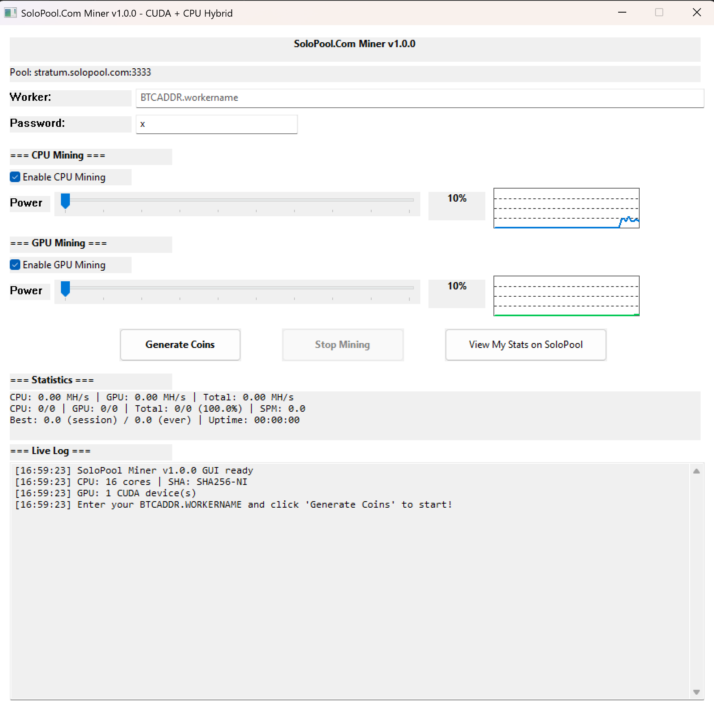

# SoloPool Miner v1.0.0

A high-performance Bitcoin solo mining application with GUI for [SoloPool.com](https://solopool.com).



## Features

- **Full Windows GUI** - Easy-to-use interface with real-time statistics
- **NVIDIA GPU Mining** - CUDA-accelerated SHA256d (~2+ GH/s on RTX 3070)
- **AMD/Intel GPU Mining** - OpenCL support for non-NVIDIA GPUs
- **CPU Mining** - SHA256-NI hardware acceleration (Intel/AMD)
- **Power Management** - Adjustable power sliders (10-100%) for CPU and GPU
- **Red Zone Mode** - Push past 80% for maximum hashrate (with warnings)
- **Real-time Graphs** - Live GPU/CPU utilization monitoring
- **Log File** - All activity logged to `solopool_miner.log`
- **Auto-connect** - Hardcoded to stratum.solopool.com:3333

## Requirements

### For Running Pre-built Binary
- Windows 10/11 (64-bit)
- NVIDIA GPU with recent drivers (for CUDA mining)
- Or AMD/Intel GPU with OpenCL support

### For Building from Source
- [NVIDIA CUDA Toolkit](https://developer.nvidia.com/cuda-toolkit) (v11.0 or later)
- Visual Studio 2019 or 2022 (for MSVC compiler)
- OpenCL SDK (usually included with GPU drivers)

## Quick Start

1. Download the latest release from [Releases](https://github.com/SoloPool-Org/solopool-miner/releases)
2. Run `SoloPoolMiner.exe`
3. Enter your Bitcoin address and worker name (e.g., `bc1qYourAddress.WorkerName`)
4. Adjust CPU/GPU power sliders as desired
5. Click **"Generate Coins"** to start mining!

## Building from Source

### Windows (NVIDIA CUDA)

```batch
nvcc -O3 -arch=sm_86 -allow-unsupported-compiler -Xlinker /SUBSYSTEM:WINDOWS ^
     -o SoloPoolMiner.exe solopool_miner.cu ^
     -lws2_32 -lcomctl32 -lgdi32 -luser32 -lshell32 -lnvml -lOpenCL
```

**Note:** Adjust `-arch=sm_XX` for your GPU architecture:
- RTX 30xx series: `sm_86`
- RTX 20xx series: `sm_75`
- GTX 10xx series: `sm_61`

### Build Options

| Flag | Description |
|------|-------------|
| `-O3` | Maximum optimization |
| `-arch=sm_XX` | Target GPU architecture |
| `-allow-unsupported-compiler` | Allow newer MSVC versions |
| `-Xlinker /SUBSYSTEM:WINDOWS` | No console window |

## Usage

### Power Settings

| Range | Description |
|-------|-------------|
| 10-50% | Light mining, minimal system impact |
| 50-80% | Balanced mining, moderate heat |
| 80-100% | **RED ZONE** - Maximum hashrate, runs HOT! |

When entering the Red Zone (>80%), you'll see a warning dialog. Your hardware will run at maximum capacity - **monitor your temperatures!**

### Statistics Display

```
CPU: 25.00 MH/s | GPU: 1200.00 MH/s | Total: 1225.00 MH/s
CPU: 5/0 | GPU: 12/0 | Total: 17/0 (100.0%) | SPM: 8.5
Best: 45000.0 (session) / 47000.0 (ever) | Uptime: 01:23:45 | Diff: 3
```

- **MH/s** - Megahashes per second
- **X/Y** - Accepted/Rejected shares
- **SPM** - Shares per minute
- **Best** - Highest difficulty share found
- **Diff** - Current pool difficulty

### Log File

All activity is logged to `solopool_miner.log` in the same directory as the executable. The log persists across sessions.

## Architecture

```
┌─────────────────────────────────────────────────────────┐
│                    Win32 GUI (WndProc)                  │
├─────────────────────────────────────────────────────────┤
│  Stratum Thread  │  CPU Threads  │  GPU Thread(s)      │
│  (networking)    │  (SHA256d)    │  (CUDA/OpenCL)      │
├─────────────────────────────────────────────────────────┤
│              Shared State (thread-safe)                 │
│         job data, nonces, statistics, results          │
└─────────────────────────────────────────────────────────┘
```

## Solo Mining Odds

**Important:** Solo mining Bitcoin is essentially a lottery. With current network difficulty (~90T), even a powerful GPU has astronomically low odds of finding a block.

| Hashrate | Time to Find Block (avg) |
|----------|--------------------------|
| 1 GH/s | ~2,700 years |
| 100 GH/s | ~27 years |
| 1 TH/s | ~2.7 years |

**Why solo mine anyway?**
- Educational/hobby purposes
- Supporting network decentralization  
- The dream of hitting a ~3.125 BTC block reward minus the 2% pool fee
- No pool fees (if you win, you keep it all!)

## Troubleshooting

### "No CUDA devices found"
- Ensure NVIDIA drivers are up to date
- Verify GPU supports CUDA (most GTX 600+ series)

### "No GPU devices found"
- For AMD: Install AMD Adrenalin drivers with OpenCL
- For Intel: Install Intel Graphics drivers with OpenCL

### Low hashrate
- Increase power slider
- Ensure no thermal throttling (check GPU temp)
- Close other GPU-intensive applications

### Connection issues
- Check internet connection
- Verify firewall allows outbound port 3333
- Try restarting the miner

## ⚠️ DISCLAIMER

**USE THIS SOFTWARE AT YOUR OWN RISK.**

1. **No Warranty**: This software is provided "AS IS" without warranty of any kind, express or implied. The authors are not responsible for any damages, losses, or other liabilities arising from its use.

2. **Hardware Risks**: Mining cryptocurrency can put significant stress on your hardware. Running at high power levels (especially in "Red Zone" mode) can cause:
   - Increased electricity consumption and costs
   - Elevated temperatures that may reduce component lifespan
   - Potential hardware damage if cooling is inadequate
   - System instability

3. **Financial Risks**: 
   - Solo mining has extremely low odds of finding a block
   - Electricity costs will almost certainly exceed any rewards
   - Cryptocurrency values are volatile
   - This is NOT a get-rich-quick scheme

4. **Security**: 
   - Only download from official sources
   - Verify checksums when available
   - Never share your private keys

5. **Legal Compliance**: Ensure cryptocurrency mining is legal in your jurisdiction. You are responsible for any applicable taxes or regulations.

**By using this software, you acknowledge that you understand and accept these risks.**

## License

MIT License - see [LICENSE](LICENSE) file for details.

## Contributing

Contributions are welcome! Please feel free to submit issues and pull requests.

## Links

- **Pool**: [https://solopool.com](https://solopool.com)
- **Stratum**: stratum.solopool.com:3333
- **Support**: [SoloPool Discord/Support]

## Acknowledgments

- SoloPool.com for providing solo mining infrastructure
- The Bitcoin community

---

*Happy mining! May the hashes be ever in your favor.* 🎰⛏️
